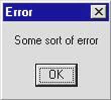
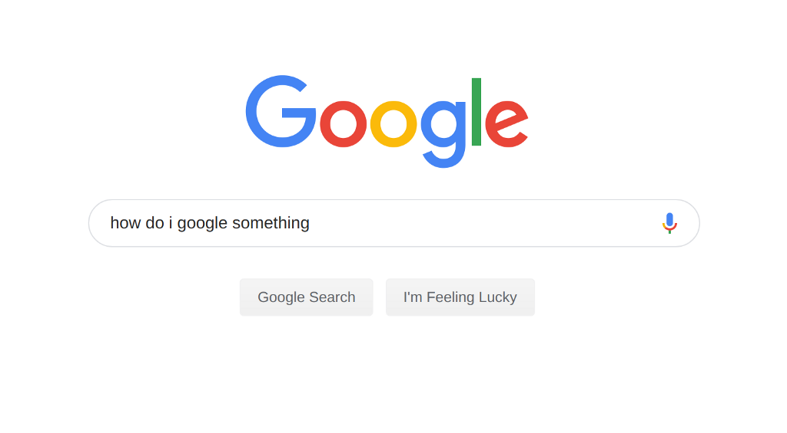

# Learning to learn

_Yechiel Kalmenson_

"You need to learn how to learn" is a phrase you will often hear as you start on your journey.

Don't worry about which language/framework resource X or course Y teaches, people will tell you, what's important is that they show you how to learn on your own.

There is truth to that. The majority of new developers don't get a job using the first stack they learned. Even if you are lucky enough to get a job using the frameworks you learned, the breakneck pace of the tech world virtually guarantees that your knowledge will be outdated in no time and you will have to learn the next shiny thing every few years.

Students who find themselves too focused on acquiring a particular technology, instead of focusing on acquiring the skills needed to keep learning on their own, might find themselves blindsided when tasked with learning a _different_ technology just to get their first junior role. They may feel like the experience they gained at their bootcamp or college (or the resources they spent self-teaching) was a waste of time and money.

Changing your perspective from thinking that you need to learn Ruby, or JavaScript, or React, or what have you, to realizing that you are really trying to learn _how to learn_ those skills will leave you better prepared for the task of finding your first job as a developer and for the lifetime of learning and growth that will follow. Not to mention that it will help you learn whatever technology it is that you decided to go with first more effectively.

But what does it mean to "learn how to learn"? What are the skills that developers use to help them keep up with a never-ending stream of new frameworks and technologies?

After many conversations with both former and potential students and career changers, I believe I was able to narrow it down to four skills that you need to acquire if you want to be able to learn on your own after graduating:

1. How to read and understand error messages.

2. How to Google things.

3. How to read and understand technical documentation.

4. How and when to take a step back and ask for help.

From my experience as a developer, I can say that I spend 90% of my workday doing one of those four things. If you can master these skills, you can be reasonably confident that there is no technology you can't pick up.

### Reading error messages

This was one of the first lessons I had to learn when learning to code, and, in my opinion, what separates developers from the rest of society.

Back in my "civilian life" error messages were scary, they were opaque, they felt like the computer was screaming at me in a foreign language and blaming me for something which it probably thought was my fault.

When I started learning how to code I naturally ran into many error messages, and that felt very discouraging; I felt like I must be doing something wrong.

Then one day it "clicked" for me. I was watching a lecture by one of the bootcamp instructors where he was coding an app. At one point he ran the code and hit an error and instead of getting embarrassed or flustered he exclaimed, completely unironically, "We hit an error! Great!" That's when I realized that error messages are far from our enemies. When we encounter an error message as developers, it's the computer's way of letting us know what's wrong with our code; it's how it provides clues on what we need to fix.

As a developer, you will be working exclusively with broken code (if the code already works then who needs you?). Reading and analyzing error messages is how you will go about fixing it.

The kinds of error messages you get and how helpful they are will depend a lot on which language/framework you are using. Some languages have more helpful errors than others, but some elements are universal.

Every error message will usually contain:

1. The error message: what actually went wrong. These can vary from a few cryptic words to a full paragraph containing suggestions on what you might be able to do to fix the bug.

2. The location where the error occurred: the file, line number, and sometimes the function name where your program was when it crashed.

3. The stack trace: all the lines in your code that the program executed until getting to the function in number 2. This can help trace where your function was called and with which parameters.

Reading all that and getting comfortable with parsing the different parts of the error message can take some practice, but that's the first place to look when your code doesn't behave the way you expect it to.

A good bootcamp or Computer Science course will encourage you to play around with the code and break things, and will celebrate error messages instead of just showing you how to fix them.

But error messages, helpful as they are, are limited in how much they can help you. After all, the designers of the language can't know in advance _all_ of the different ways programs written in their language can break. That's when the next skill comes in handy.

### How to Google stuff

As a developer, you will spend the majority of the time doing things you don't know by heart. Google (or DuckDuckGo, Bing, etc.) will be your best friend.

For beginners, it can be hard to know what to Google for, especially in the beginning when you aren't even sure what it is you're trying to do, never mind verbalize it in a way that a search engine can understand. Learning how to structure your query for best results is an art that comes with experience, but some rules will help you get started:

- Include the language you are using: if you are learning Ruby and have an array you want to sort, searching for "how to sort an array" will probably not be very helpful; when I just did it the first page of results contained only answers about how to do it in Java, Visual Basic, and JavaScript. Always start your query with the name of the language you are searching for (in our example, "ruby sort an array" will give you plenty of results that a Ruby programmer would actually find useful).

- Use well-defined keywords: this comes more with experience, but knowing which keywords represent the actual information you need will save you time filtering through unhelpful results. As a general rule, don't include words that aren't necessary; crafting the shortest query that contains all the keywords relevant to your search will help make sure that you get only the results you want.

- Know which results are more likely to be helpful: again, this comes with experience, but some results are more likely to be useful than others. You will develop a taste for this with time, but in general, more recent results are less likely to be out of date, and an answer on Stack Overflow with a hundred upvotes is more likely to be helpful than a blog-post from a no-name author (which isn't to say there aren't great blog-posts by relatively unknown authors).

This last point brings us to the next skill.

### How to read technical documentation

Languages/frameworks have many features and functions, and unless you use a particular function on a semi-regular basis, it is unlikely that you will have the syntax memorized.

This doesn't mean that you are a lousy programmer. Even accomplished programmers with many years of experience find themselves Googling things like "concatenate a string" or "filter an array."

_Source: [https://twitter.com/dhh/status/834146806594433025?lang=en](https://twitter.com/dhh/status/834146806594433025?lang=en). DHH is the founder of Basecamp and the creator of Ruby on Rails, one of the most popular frameworks for web development._

The documentation for most languages is usually the most comprehensive and concise reference for language features, saving you the trouble of memorizing hundreds of obscure language features.

For example, Ruby has about 20 different ways to iterate over an array. If you are trying to learn Ruby, you might think that you have to memorize all 20, but if your goal is to learn how to learn then all you have to remember is that you can find all the ways of iterating over an array in the documentation on [Ruby's Enumerable module](https://ruby-doc.org/core-2.6.1/Enumerable.html).

The problem for beginners is that the documentation can look dense and intimidating; its conciseness means that the page can look like a scary wall of jargon and technical terms and symbols, but with practice, you can learn the patterns and learn how to find the information you need. With time you will see that the official docs will become your go-to reference for simple syntax.

### Ask for help

Finally, there is another very crucial skill that is not exactly about self-learning, but it's an essential skill to have if you want to be an effective learner.

_Photo: [WOCinTech Chat](https://www.flickr.com/photos/136629440@N06/25392428253). Unmodified image licensed under [CC BY 2.0](https://creativecommons.org/licenses/by/2.0/deed.en)_

The last skill is knowing when to step back and ask for help.

None of us ever did it on our own; the "self-taught developer" is a myth.

Surrounding yourself with a network of mentors and fellow learners, and knowing when/how to leverage said network, will save you time best spent actually learning new things. It will mean that you don't have to spend hours banging your head against the keyboard over a simple typo that a second, fresh pair of eyes would have caught right away (though we've all been there).

There are many online communities geared at beginners. If you are in a bootcamp they probably have ways for students (both current and former) to connect. Dev Twitter is extremely friendly, helpful, and supportive (some of my favorite communities are the [#CodeNewbie](https://twitter.com/CodeNewbies) community and [@ThePracticalDev](https://twitter.com/ThePracticalDev)). Find your corner, your people you connect with, and you will see that traveling together is 100 times better than traveling alone.

### In conclusion

In conclusion, learning to code is a big decision. Many factors are involved in what makes a good bootcamp, course, or resource. I hope that reading this chapter will give you an idea of which skills are essential to focus on and which are just a passing fad.

Good luck!