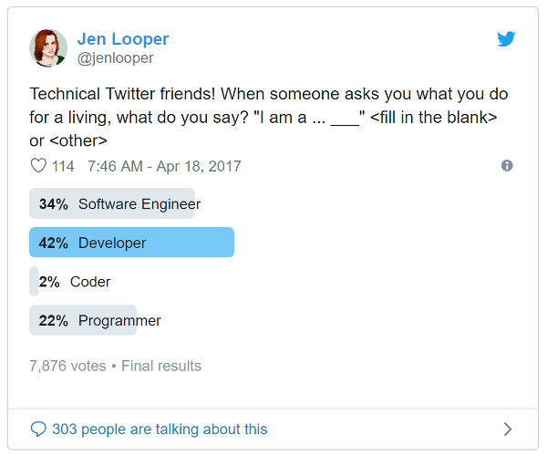

# Choosing a job title

_Isaac Lyman_

### Are you a coder, programmer, developer, engineer, architect or something else?

My first job was an underage, under-the-table weekend gig at a pizza parlor. I'd show up at the local strip mall early Saturday morning, stash my bike, and clock in. For me, the work was grueling. I would haul 50-pound bags of flour and 10-gallon buckets of water to a giant stand mixer, and once it finished spinning I'd lift armfuls of incredibly heavy dough to a metal table where I'd cut and oil portions weighed for each size of pizza that the shop sold. By noon, I'd be exhausted. I'd clock out and head home. And once a month I'd pick up an envelope with about $100 cash in it. It was an awesome first job.

My official job title was Dough Boy (yes, like the Pillsbury mascot). But "Dough Boy" isn't very impressive on a resume, so for a while I listed my job title as "Dough Chef." A teenager's got to have some dignity, right? In the end, I don't think anybody cared.

Little did I know, that was the least problematic job title I would ever have.

I became a programmer several years ago. In 21st-century America---especially in the tech sector---job titles are surprisingly fluid. I haven't had an employer dedicate any real thought to my job title for a long time. In fact, my first employer in the industry told me I could put whatever I wanted on my resume and if anyone called she'd back me up. Naturally, I was tempted to write "Senior Department Lead QA III Technical Architect", when in fact I was just writing Selenium tests in a cubicle. Go figure.

I've often puzzled over the plethora of job titles I now fit under. I write web applications for a startup, so I do something at every level of the stack, from SQL Server at the bottom to CSS at the top. There are a lot of things I _could_ call myself: coder, programmer, engineer, developer, boffin. In keeping with my pizza-infused legacy, I could even call myself a [Software Boy](https://twitter.com/ivetwodads/status/854358415799312384). So what _am_ I?

_Source: [https://twitter.com/jenlooper/status/854345325032747009](https://twitter.com/jenlooper/status/854345325032747009)_

I've discovered that I'm far from the only one who has this question. And there are a lot of variables to consider, so it's not an easy one. In some countries it's illegal to call yourself an engineer unless you have certain certifications. In some cultures, general words (like "consultant") may be preferred over technical jargon (like "application developer"). And in the United States, where I live, small differences in a job title can make a significant difference in salary.

This is my attempt to aggregate all the data I can find about the swath of job titles that apply to people who code. I've gathered average salary information and definitions for several job titles that might apply (but surely not all of them).

I've ignored titles like _hacker_, _ninja_, and _rockstar_ because they're silly and meaningless.

### Sources

I pulled salary information from the U.S. Bureau of Labor Statistics (BLS), Glassdoor, PayScale, and Indeed. Definitions come from the BLS or Wikipedia where available. Where neither has a definition, I've searched out the most succinct, authoritative source I can find.

### Salary data

This data is categorized by job title. Job titles are ordered by a subjective estimate of their complexity, from least complex to most complex. Data was gathered in May 2019.

Each entry has a definition, national (USA) median salary data from each source, an average of the salary data points, and a variability assessment (how wide the range of salary estimates is). Where a specific job title or equivalent was not found in a database, "N/D" is used.

_Statistical Note:_ PayScale.com uses the words "average" and "median" interchangeably. That's not how [math](https://www.vocabulary.com/articles/chooseyourwords/mean-median-average/) works, but oh well. Glassdoor and Indeed don't offer a median at all, preferring a [much less useful](https://surveymethods.com/blog/when-is-it-generally-better-to-use-median-over-mean/) average. In a perfect world everyone would use medians for data sets like this, since they may or may not follow a normal curve.

**Coder**

> _[A] person who writes computer code; a computer programmer._ ~[Dictionary.com](http://www.dictionary.com/browse/coder)

| Source      | Salary                                                                    |
| ----------- | ------------------------------------------------------------------------- |
| BLS         | N/D                                                                       |
| Glassdoor   | [$46,930](https://www.glassdoor.com/Salaries/coder-salary-SRCH_KO0,5.htm) |
| Indeed      | N/D                                                                       |
| PayScale    | N/D                                                                       |
| Average     | N/D                                                                       |
| Variability | N/D                                                                       |

_Notes:_ I'd usually avoid a site with so little street cred as Dictionary.com, but definitions for this word are surprisingly scarce.

**Programmer**

> _Create, modify, and test the code, forms, and script that allow computer applications to run. Work from specifications drawn up by software developers or other individuals._ ~[BLS](https://www.bls.gov/oes/current/oes151131.htm)

| Source      | Salary                                                                          |
| ----------- | ------------------------------------------------------------------------------- |
| BLS         | [$84,280](https://www.bls.gov/oes/current/oes151131.htm)                        |
| Glassdoor   | [$68,478](https://www.glassdoor.com/Salaries/programmer-salary-SRCH_KO0,10.htm) |
| Indeed      | [$73,643](https://www.indeed.com/salaries/Programmer-Salaries)                  |
| PayScale    | [$61,527](http://www.payscale.com/research/US/Job=Computer_Programmer/Salary)   |
| Average     | $71,982                                                                         |
| Variability | Medium. Range of ~$22k.                                                         |

**Developer**

> _[A] person or company that develops computer software._ ~[Merriam-Webster](https://www.merriam-webster.com/dictionary/developer)

| Source      | Salary                                                                        |
| ----------- | ----------------------------------------------------------------------------- |
| BLS         | N/D                                                                           |
| Glassdoor   | [$80,394](https://www.glassdoor.com/Salaries/developer-salary-SRCH_KO0,9.htm) |
| Indeed      | [$93,386](https://www.indeed.com/salaries/Developer-Salaries)                 |
| PayScale    | N/D                                                                           |
| Average     | $86,890                                                                    |
| Variability | Medium. Range of ~$13k.                               |

_Notes:_ Several people have pointed out that the term "developer" could refer to someone in real estate as well as someone in software, so it's hard to know if these results are meaningful.

**Front End Developer**

> _A front-end developer is a type of computer programmer that codes and creates the visual front-end elements of a software, application or website. He or she creates computing components/features that are directly viewable and accessible by the end user or client._ ~[Techopedia](https://www.techopedia.com/definition/29569/front-end-developer)

| Source      | Salary                                                                                     |
| ----------- | ------------------------------------------------------------------------------------------ |
| BLS         | N/D                                                                                        |
| Glassdoor   | [$77,908](https://www.glassdoor.com/Salaries/front-end-developer-salary-SRCH_KO0,19.htm)   |
| Indeed      | [$102,297](https://www.indeed.com/salaries/Front-End-Developer-Salaries)                   |
| PayScale    | [$69,773](http://www.payscale.com/research/US/Job=Front_End_Developer_%2f_Engineer/Salary) |
| Average     | $83,326                                                                                 |
| Variability | Extreme. Range of ~$32k.                                                                   |

**Web Developer**

> _Design, create, and modify Web sites. Analyze user needs to implement Web site content, graphics, performance, and capacity._ ~[BLS](https://www.bls.gov/oes/current/oes151134.htm)

| Source      | Salary                                                                             |
| ----------- | ---------------------------------------------------------------------------------- |
| BLS         | [$69,430](https://www.bls.gov/oes/current/oes151134.htm)                           |
| Glassdoor   | [$75,487](https://www.glassdoor.com/Salaries/web-developer-salary-SRCH_KO0,13.htm) |
| Indeed      | [$72,644](https://www.indeed.com/salaries/Web-Developer-Salaries)                  |
| PayScale    | [$58,593](http://www.payscale.com/research/US/Job=Web_Developer/Salary)            |
| Average     | $69,038.50                                                                         |
| Variability | Medium. Range of ~$15k.                                                               |

**Full Stack Developer**

> _The term full-stack means developers who are comfortable working with both back-end and front-end technologies. To be more specific, it means that the developer can work with databases, PHP, HTML, CSS, JavaScript and everything in between, also, venturing as far as converting Photoshop designs to front-end code._  ~[George Fekete on SitePoint](https://www.sitepoint.com/full-stack-developer/)

| Source      | Salary                                                                    |
| ----------- | ------------------------------------------------------------------------- |
| BLS         | N/D                                                                       |
| Glassdoor   | N/D                                                                       |
| Indeed      | [$111,117](https://www.indeed.com/salaries/Full-Stack-Developer-Salaries) |
| PayScale    | N/D                                                                       |
| Average     | N/D                                                                       |
| Variability | N/D                                                                       |

_Notes_: [There's](https://dev.to/remotesynth/theres-no-such-thing-as-a-full-stack-developer-2fp9) [significant](https://vitamintalent.com/blog/what-the-heck-is-a-full-stack-developer) [doubt](https://medium.com/@alexkatrompas/the-hard-truth-about-the-full-stack-developer-myths-and-lies-945ffadeeb8c) as to whether this is a "real" job title, insofar as it refers to being an expert in several different layers of web technology. Given that Indeed is the only site to cough up a salary value, it seems that the industry shies away from it, whether for this reason or another one.

**Software Developer**

> _Develop, create, and modify general computer applications software or specialized utility programs. Analyze user needs and develop software solutions._ ~[BLS](https://www.bls.gov/oes/current/oes151132.htm)

| Source      | Salary                                                                                  |
| ----------- | --------------------------------------------------------------------------------------- |
| BLS         | [$103,620](https://www.bls.gov/oes/current/oes151132.htm)                               |
| Glassdoor   | [$80,018](https://www.glassdoor.com/Salaries/software-developer-salary-SRCH_KO0,18.htm) |
| Indeed      | N/D                  |
| PayScale    | [$69,928](http://www.payscale.com/research/US/Job=Software_Developer/Salary)            |
| Average     | $84,522                                                                              |
| Variability | Extreme. Range of ~$33k.                                                                |

**Software Engineer**

> _A software engineer is a person who applies the principles of software engineering to the design, development, maintenance, testing, and evaluation of the software and systems that make computers or anything containing software work._ ~[Wikipedia](https://en.wikipedia.org/wiki/Software_engineer)

| Source      | Salary                                                                                 |
| ----------- | -------------------------------------------------------------------------------------- |
| BLS         | N/D                                                                                    |
| Glassdoor   | [$103,035](https://www.glassdoor.com/Salaries/software-engineer-salary-SRCH_KO0,17.htm) |
| Indeed      | [$107,366](https://www.indeed.com/salaries/Software-Engineer-Salaries)                 |
| PayScale    | [$84,023](http://www.payscale.com/research/US/Job=Software_Engineer/Salary)            |
| Average     | $98,141.33                                                                                |
| Variability | Medium. Range of ~$23k.                                                                |

_Notes:_ In classic Wikipedia style, this definition is bafflingly circular. However, if you ignore the "principles of software engineering" part, the definition becomes useful.

**This concludes a nearly-complete list of job titles that apply to regular devs.** However, I'm going to go a bit further and see what "Junior", "Senior" and "Architect" do to a job title, even though these terms lie outside the mainstream.

**Junior Software Developer**

> _An entry-level engineer with limited exposure to development and development practice who will need strong mentoring and support to grow their skills._ ~[James Turnbull on Kartar.Net](https://kartar.net/2015/09/so-what-exactly-is-a-junior-software-engineer/)

| Source      | Salary                                                                                         |
| ----------- | ---------------------------------------------------------------------------------------------- |
| BLS         | N/D                                                                                            |
| Glassdoor   | [$64,962](https://www.glassdoor.com/Salaries/junior-software-developer-salary-SRCH_KO0,25.htm) |
| Indeed      | [$59,913](https://www.indeed.com/salaries/Junior-Software-Developer-Salaries)                  |
| PayScale    | [$59,579](http://www.payscale.com/research/US/Job=Junior_Software_Engineer/Salary)             |
| Average     | $61,484.67                                                                                        |
| Variability | Very low. Range of ~$5k.                                                                       |

**Senior Software Developer**

> _...either someone with a deep specialised knowledge beyond their peers or someone who leads or instructs other developers._ ~[Robert Rees on The Guardian](https://www.theguardian.com/info/developer-blog/2014/aug/28/what-does-it-mean-to-be-a-senior-developer)

| Source      | Salary                                                                                                       |
| ----------- | ------------------------------------------------------------------------------------------------------------ |
| BLS         | N/D                                                                                                          |
| Glassdoor   | [$95,791](https://www.glassdoor.com/Salaries/senior-software-developer-salary-SRCH_KO0,25.htm)              |
| Indeed      | N/D                               |
| PayScale    | [$101,732](http://www.payscale.com/research/US/Job=Sr._Software_Engineer_%2f_Developer_%2f_Programmer/Salary) |
| Average     | $98,761.5                                                                                                     |
| Variability | Very low. Range of ~$6k.                                                                                      |

**Software Architect**

> _A software architect is a software expert who makes high-level design choices and dictates technical standards, including software coding standards, tools, and platforms._ ~[Wikipedia](https://en.wikipedia.org/wiki/Software_architect)

| Source      | Salary                                                                                   |
| ----------- | ---------------------------------------------------------------------------------------- |
| BLS         | N/D                                                                                      |
| Glassdoor   | [$132,510](https://www.glassdoor.com/Salaries/software-architect-salary-SRCH_KO0,18.htm) |
| Indeed      | [$142,078](https://www.indeed.com/salaries/Software-Architect-Salaries)                  |
| PayScale    | [$121,645](http://www.payscale.com/research/US/Job=Software_Architect/Salary)            |
| Average     | $132,077.67                                                                              |
| Variability | Medium. Range of ~$20k.                                                                 |

### Analysis

**Salaries**

Job titles by salary from lowest to highest are:

- Junior Software Developer
- **Web Developer**
- **Programmer**
- Front End Developer
- **Software Developer**
- Developer
- Software Engineer
- Senior Software Developer
- Software Architect

Coder and Full Stack Developer were lacking data. Since the BLS probably has the largest and least-biased data set, I've bolded the job titles that had BLS data available. Incidentally, the ordering of the list holds when BLS data is considered alone.

This data should be taken with a grain of salt for several reasons:

- I don't have access to the original data sets. I don't know the size of those data sets or the algorithms used to calculate their average/median. I don't have access to demographics data, so important variables like race, gender, orientation and class aren't considered here. A data set of known size and diversity would yield better analysis.
- Glassdoor and Indeed are fundamentally job boards, not public data sets. Their data is based on volunteered information: self-reported salaries and job postings. This makes it prone to several forms of survey bias.
- PayScale, Glassdoor and Indeed are private companies and their data isn't public. Any private company is accountable to its shareholders, not the general public, and may be incentivized to gather and calculate data in a way that increases the value of their product to customers. For example, employers posting jobs on Indeed may prefer the site to report lower average salary data, which would make their salary offers seem more competitive. Indeed could do this by focusing its marketing on regions with low cost of living and low average salary, which would skew its self-reported salary data toward the lower end of the scale. I'm not saying they do this, but it could be profitable for them to do so.

The difference in average salary between a Developer and a Software Developer is about $3k, which probably is not statistically significant. On the other hand, the difference between a Software Developer and a Software Engineer is $13k, which may be meaningful. The biggest leap in salary is from Senior Software Developer to Software Architect, with a difference of about $33k.

There are several more slight variations in wording that I could have looked into. A Senior Software Engineer, for example, probably makes a little bit more than a Senior Software Developer, and a Senior or Chief Software Architect surely makes more than a Software Architect. But this should be enough to provide insight into a general trend.

**Definitions**

Enough with the cash: what's the _qualitative_ difference between these roles?

First of all, some titles to avoid (or at least approach with caution):

- _Coder_ had the lowest Glassdoor salary of any position I looked at, even lower than Junior Software Developer. It's hard to argue in its favor. First of all, it's much too brazen---it's like a construction worker calling himself a Nailer or a doctor calling herself a Scalpeler. "Code" is better as a noun than a verb; it's a tool you use to achieve a goal. If a candidate for a position at my company billed themself as a Coder, it would give me the impression that they like to be told what to do and how to do it---that is, they'll write the code, but they won't make decisions, interact with people, or suggest ways to improve. That sounds like an unfulfilling way to build software. What's worse, an employer who creates a job posting for a Coder probably isn't looking for someone who engineers elegant solutions to complex problems---they probably have only a shallow understanding of what software is, and want to hire the cheapest person they can find to "just build a really simple app."
- _Full Stack Developer_ seems to beg the question, "but what are you _good_ at?" As I've mentioned, people tend to be incredulous of a candidate who claims to be an expert at every level of the stack. There's simply no way a normal person can keep up with everything. And knowing a single technology at each layer (say, JavaScript, REST, .NET and SQL Server) probably doesn't cut it. Sure, those are the technologies in _your_ stack, but someone else's stack may consist of Dart, Falcor, Python and Couchbase. You're not a Full Stack Developer where they're concerned. At best you're a regular Developer who's willing to learn some new tech.
- _(Computer) Programmer_ is a term that's gone the way of the dinosaur, along with the stereotype of the shirt-and-tie-wearing geek in a cubicle. [All the word really means](http://chrislema.com/programmer-developer-engineer/) is _someone who knows a programming language_. This used to be a rare skill (and only moderately in demand). But modern software construction demands more than just syntax and vocabulary---the essential domains of "programming"---because modern _software_ is more than just a command-line interface and a set of database files on a floppy disk. Apps have to be beautiful, accessible, user-friendly, fast, and above all, competitive. The word "Programmer" doesn't evoke any of that.
- _Developer_ is, as previously noted, an unnecessarily ambiguous title. If your job involves building condominiums, you're reading the wrong book. If your job involves computer code, you should call yourself a _Software_ Developer. Anything built with code is software, so this is more about clarification than qualification.
- _Front End Developer_ is a very volatile title. Not only does it have almost the highest salary variability of all the job titles researched, but anecdotally I've heard it defined in contradictory ways. For some people, _Front End Developer_ refers to a person who knows HTML and CSS but not JavaScript; for others, a Front End Developer is someone who has a deep knowledge of JavaScript and its most popular frameworks and libraries. The solution, in my mind, is to call yourself a _JavaScript Developer_ if that's where your expertise lies, and to call yourself a _Web Designer_ or _CSS Developer_ if you specialize in HTML and CSS.

The remaining titles differ semantically, but not in ways that necessarily make any of them superior. You should determine which one best describes your career path:

- _Software Developer_ and _Software Engineer_ are, by many accounts, equivalent. Both mean that a person knows the best practices in their field, is comfortable with multiple technologies, and has transferable skills that allow them to recognize and write good code in any language. These titles also indicate the ability to make smart decisions about software design and implementation, and a willingness to participate in the software lifecycle above and beyond writing code (see "Development beyond the keyboard" for more on this topic). Developers and engineers are creative, thoughtful, knowledgeable people who deserve a place at the table in every discussion about a product. "Engineer" connotes more seniority and preciseness than "Developer", so some would say that younger or less credentialed developers run the risk of sounding pretentious if they bill themselves as Engineers. But considering that the average salary difference between them is about $14k, I'd recommend using the term "Engineer" as long as there aren't any legal barriers to doing so.
- _Web Developer_ is a title that flirts with ambiguity, if less dangerously than _Front End Developer_. I've seen the term used to mean "a person who builds web applications, including the server side" or just "a person who knows JavaScript." But as unclear as it is to industry insiders, it may be perfect for freelancers who cater to the "just make me a website" clientele. Most individuals and small business owners don't understand the complexities of front-end and back-end; if they hire a developer, it's to create an attractive single-purpose site that will show up in Google results. I suspect that _Web Developer_ is exactly what they're looking for. If you're not a contractor, _Software Developer_ may describe you more efficiently (and give you a $15k bump in average salary).
- _Junior_ and _Senior_ are prefixes that make a big difference in salary. Generally speaking, you're a _Junior Developer_ for your first few years or so in the industry, and you're not a _Senior Developer_ until a few years after that. But most developers agree that graduating from _Junior Developer_ to _Developer_ and from _Developer_ to _Senior Developer_ has less to do with the length of your career and more to do with your humility, leadership, versatility, and experience (especially the number of catastrophic failures under your belt).
- _Software Architect_ is the most highly-paid job title on this list, and with good reason. It represents a high standard and has a stable definition industry-wide. The Software Architect is the ultimate technological resource---the person who's "been there and done that" so many times they can practically predict the future. At the last company where I worked, the Enterprise Architect was equal in status to the CTO. It's a position of extreme responsibility and respect. You probably already know if this is you.
- One more title I didn't investigate in depth is _x Developer_ or _x Engineer_, where _x_ is a specific language, framework or technology. For example, I could call myself a _JavaScript Developer_, a _Vue Developer_, or a _.NET Engineer_, and this would remove the ambiguity about what I'm primarily good at. I would choose one of the above based on my career goals, or combine two of them, e.g. _Vue / .NET Developer_. To look at every kind of _x Developer_ would have increased the scope of this chapter far beyond its original purpose, but in my opinion it's the most useful job title there is for someone who codes. Of course, if you don't feel comfortable associating yourself with a specific technology, _Software Developer_ is a totally acceptable alternative.

I hope the data I've provided helps you in the process of choosing your job title.

### Bibliography & further reading

- [The role of a Senior Developer, by Matt Briggs](http://mattbriggs.net/blog/2015/06/01/the-role-of-a-senior-developer/). This is an excellent take on the skill metrics that various levels of developers should measure themselves against, rather than composing job titles based on years of experience.
- [When should you call yourself a senior developer? on Stack Exchange](https://softwareengineering.stackexchange.com/q/25564). A few different takes on what makes a "senior" versus "junior" developer.
- [What's the difference between Entry Level/Jr/Sr developers? on Stack Exchange](https://softwareengineering.stackexchange.com/questions/14914/whats-the-difference-between-entry-level-jr-sr-developers). Some worthy additions to the above.
- [What does it mean to be a senior developer? on The Guardian](https://www.theguardian.com/info/developer-blog/2014/aug/28/what-does-it-mean-to-be-a-senior-developer). What an above-average set of qualifications looks like.
- [Programmer, Developer, Engineer: What's in a name? by Chris Lema](http://chrislema.com/programmer-developer-engineer/). A brief (and fairly representative) interpretation of the three main nouns in development job titles.
- [Developer, Programmer or Engineer? on Stack Overflow Talent](https://www.stackoverflowbusiness.com/blog/developer-programmer-or-engineer). Some survey data and well-considered quotes from industry insiders.
- [Job Titles in the Web Industry, by Chris Coyier on CSS-Tricks](https://css-tricks.com/job-titles-in-the-web-industry/). I think the distinctions here may be a little too rigid, but to ignore Coyier's take on the subject would be a significant omission. At the very least, this is a good reference on what various titles _should_ mean.
- [What Does a Software Architect Do? by Yegor Bugayenko](http://www.yegor256.com/2014/10/12/who-is-software-architect.html). This article proposes that being a software architect isn't just about smarts or experience, it's about accountability and responsibility.
- [The Role of Software Architect, by Bredemeyer Consulting](http://www.bredemeyer.com/who.htm). Frames the architect as part technologist, part business strategist---meaning that the sharpest dev in the company may or may not be a good fit for the job.
