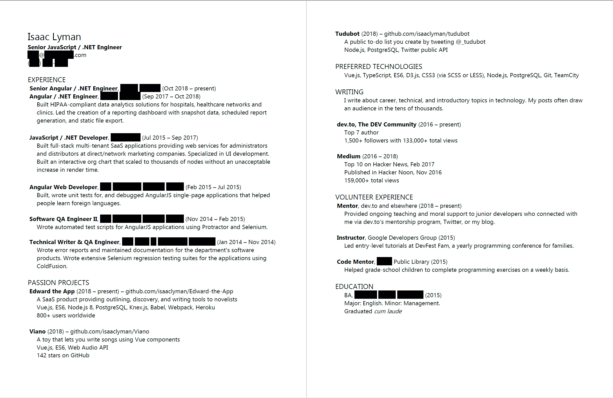

# Getting your first job

_Isaac Lyman with Clifford Fajardo_

Getting hired is hard at first. I mean, eventually you'll have an amazing resume and recruiters will be flooding your inbox with interview requests, but for the first little while it can seem like an incredibly tough market. Everyone's looking for senior developers, interviews are all whiteboards and obscure data structures, and some jobs turn out to be unpaid "internships" or "software farms" that mistreat and devalue their employees.

Luckily, software development is a field where you can get a lot of valuable experience without even having a job. And there are things you can do to improve your resume, grow your network, build your skills, and interview at better companies, all without a heavy time investment.

### Side projects

Coding in your spare time may not be appealing or even possible for everyone, but it's an effective way to add qualifications to your resume. Even a small project put together over the weekend can add value to your portfolio. There are a few different sites where you can upload your projects for free. The [most popular](https://en.wikipedia.org/wiki/Comparison_of_source-code-hosting_facilities#Popularity) is [GitHub](https://github.com/), with over 100 million projects hosted, but BitBucket and GitLab are also popular choices.

A side project can fulfill many purposes. It can help you learn a framework or tool that's trending in the market, explore a technique you want to apply at work, exercise your creativity, prototype a product you want to start your own company with, and/or demonstrate your technical skills. And because you're building it for yourself, you may find that it's far less frustrating than coding at your day job. In fact, if my job is growing too tedious, I sometimes use a side project to remind myself why I love code. Taking time to create without limits or rules is always refreshing.

Potential employers who review your projects will be looking for a few different things:

- Well-organized folders and files. Most programming languages and frameworks have conventions for how things are organized. If your chosen technology doesn't, use a consistent structure that makes everything easy to find. Most files should be relatively small (a few hundred lines or less).
- Consistent code style. It doesn't matter what styles you choose (tabs or spaces, line lengths, brackets on their own line), as long as you stick to them.
- Unit tests. Writing tests shows that you care about code quality and maintainability.
- Documentation. The ability to describe and explain your code makes you a better teammate. You should at least have a "Readme" file explaining how to set up the project and run the tests.

If you have trouble coming up with project ideas, start with something simple: a tic-tac-toe game, an "About Me" web page, a metric unit converter.

### Revising your resume

When you're working on your resume, consider the following guidelines:

- Use standard, professional typefaces like Helvetica or Times New Roman. Don't use more than two.
- Use a professional-looking email address. Employers will think twice about interviewing you if your email address is "doomslayer420@onlinedating.com".
- Put the most impressive stuff at the top of your resume and the least impressive stuff at the bottom. If that means your education and job experience are on page 2, that's okay. Don't let fluff like a "personal statement" or "career goal" take the top spot unless it's expected in the industry or culture you're applying in.
- Don't overcomplicate. Unless you're a visual designer, you should avoid using images, illustrations, or multiple colors.
- People scan down the left side of the page when they're in a hurry, so left-align everything and put main points like categories, job titles, and project names in bold or capital letters.
- Be consistent. Make sure you're using the same typeface, font size, emphasis, bullets, alignment and spacing throughout your resume for headers and text at every level.
- Mention specific technologies, programming languages, and projects you've worked with. Hiring managers love specifics.
- Hiring managers also love numbers. Quantify your work wherever you can. Even if your last job was shift manager at a fast food place, you can say something like "Responsible for \$2 million per year of physical product, serving over 180,000 customers."
- Resumes aren't only for job history. Include everything you've done that's relevant to your career. If you have a blog or GitHub profile, you've presented at a meetup or contributed to open source projects, you were president of a coding club in high school, or you were top of your class at development bootcamp, it belongs on your resume!
- Always provide your resume as a PDF.
- Don't call your resume "Resume.pdf". It will get lost too easily. Instead, use your name, job title, and (optionally) the date of the most recent revision: "Isaac Lyman - Software Engineer - Mar 2019.pdf".
- If English isn't your first language, ask a native speaker to review your resume and help you with spelling and grammar. This can make a big difference in the number of interviews you get.

A resume doesn't have to be complicated. Here's mine (slightly anonymized):

### Meetups, events and channels

The best way to meet other developers and find out about jobs that aren't posted online is to go to meetups and events. Meetups are easily found in most cities, and often associated with a specific technology or product (for example, you can Google "Vue meetup" or "Adobe user group"). If you go to a small meetup, you may be asked to introduce yourself, which is a great opportunity to mention that you're looking for work. By the time the meetup is over you should have a couple of new leads. Larger meetups don't usually do this, but you can still meet a lot of local developers and find new opportunities if you attend.

Tech companies sometimes host events for developers to socialize and learn about their products, so this can also be a good way to expand your job search. You can find out about these events by following those companies and their employees on social media. (Programmers in particular have a strong presence on Twitter.) Tech conferences can be good events for networking as well, but are usually expensive (they assume your company is paying for the ticket).

It's also pretty common for a city---or, in the case of Utah, an entire state---to have a Slack workspace or other chat room for software developers. If you join, you can find out about open job opportunities by searching the archives or asking around. If you belong to a minority group, you can find a relevant Slack channel (like [latinos.slack.com](http://latinos.slack.com/) for Latinx people in tech, [blacksintechnology.slack.com](http://blacksintechnology.slack.com/) for black people, or [womenintechto.com](http://womenintechto.com/) for people who identify as women, genderqueer or non-binary).

Learning about roles from other developers is ideal. They'll usually tell you more about a company's work environment, benefits, and pay than you'd learn from an online posting or a recruiter.

### Mentors

A strong connection to someone with a lot of industry experience can be game-changing. If you don't have a mentor, set a goal now to find one. "Professional generosity" is one of the unwritten core values of the programming world, so if you reach out to a few developers you'll likely find at least one who's willing to answer questions, introduce you to recruiters, and give you career advice. (Others may be too busy or just not interested---don't let that discourage you.)

In your search for a mentor and in your career in general, social media can be invaluable. If you don't have an account on Twitter or LinkedIn, setting one up is a great next step. An account on [dev.to](https://dev.to) will also help you meet and learn from other programmers.

The best way to begin a mentoring relationship is to choose a programmer you know or admire, introduce yourself if they don't know you, and ask them a specific knowledge-based question, like "how did you find your first job?" or "can you help me understand how to search an array?" If they don't respond, you can follow up later, but don't be offended if they never get back to you (some programmers get hundreds of requests like this). If they do respond and the interaction goes well, you can ask another question or even ask for help with something bigger, like "can you help me practice for my next interview?" or "can you introduce me to someone in your area who's hiring?" Be patient and let the relationship grow. If you are polite and thank them for their time, you could end up with a connection that will transform your whole career.

Keep in mind that your mentor is just another developer and they don't know everything. They won't be able to solve all your problems or tell you exactly what to do. But their encouragement and advice can still make a big difference.

### Interviewing

Interviewing is a skill that most people have to learn the hard way. The best way to get better at it is to practice; apply for a variety of jobs, even jobs you don't feel qualified for.

Companies vary widely by the way they vet candidates. Be prepared for multiple types of interviews:

- An _unstructured interview_ is one of the most popular but least effective forms of screening. Any interview where the questions aren't chosen in advance is unstructured. These often include questions about your work experience, hobbies, problem-solving approach, and career goals. I recently read a story about a CEO who hired someone on the spot after a brief, casual conversation, claiming that he could tell more about a person from five minutes face-to-face than from any amount of structured interviewing. This CEO was wrong. [Multiple](http://journal.sjdm.org/12/121130a/jdm121130a.pdf) [studies](https://blogg.hrsverige.nu/wp-content/uploads/2010/04/Stubborn1.pdf) [have](https://www.nytimes.com/2017/04/08/opinion/sunday/the-utter-uselessness-of-job-interviews.html) [found](https://hbr.org/2016/04/how-to-take-the-bias-out-of-interviews) that selecting candidates using unstructured interviews is worse than choosing them at random.
- A _take-home project_ is a technical assignment candidates are expected to complete on their own time, like creating a simple website or adding features to an example app. This usually takes four to five hours. Be aware that some companies use this as a dishonest way to get free work; if you're being asked to spend an unreasonable amount of time, or to do work that an employee would do, ask them to pay you for your time.
- A _verbal technical interview_ is a structured interview including several questions about programming languages, technologies, software architecture, and problem-solving. Many companies make the mistake of asking questions that could easily be Googled on the job. You can prepare for these using a Google query such as "JavaScript interview questions".
- A _whiteboard interview_ involves asking candidates to write code on a whiteboard without consulting reference books or the internet. Whiteboarding is quickly falling out of style because writing code on a board and writing code on the job are very different skills. If you are asked to whiteboard, focus more on finding a solution than writing perfect code. Even pseudocode (see Appendix A) is usually fine.
- A _live coding interview_ is an interview where candidates are asked to write code while the interviewer watches, either in person or on a screen-sharing call. Being watched while you code can be nerve-wracking, but it's also something you can easily practice with a friend.
- A _short-term contract_ is like a "trial period" for employment. Candidates sign a limited contract (usually for less than a month) during which they work like a regular employee and are paid by the hour. When the contract is complete, the candidate may be hired as a full-time employee.

In every contact with a company, remember that it's not about why you need _them_---it's about why they need _you_. Figure out what kinds of problems you're good at solving, then communicate that to them clearly and confidently.

Be sure not to let your interviews be one-sided. Take the opportunity to ask serious questions about the company. Some of my favorite things to ask in an interview are:

- "What keeps you at this company when there are so many other opportunities for a software developer like yourself?"
- "How much overtime have you worked in the last year?"
- "How hard is it to buy an educational book on company money?"

Depending on the culture and circumstances where you live, you may also want to ask about company ethics, paid time off, parental leave, retirement savings plans, tuition reimbursement, or anything else that's important to you (for a longer list of values that might fit the bill, check out [keyvalues.com](https://www.keyvalues.com/)). This is stuff you don't want to be surprised by later on.

Keep in mind that some interview questions are illegal in many parts of the world. For example, in the United States, an interviewer [cannot ask certain questions](https://www.betterteam.com/illegal-interview-questions) about your marital or family status, sexual identity, disabilities, or religion, among other things.

It's worth checking the company's reviews on Glassdoor before the interview to look for red flags---every company will have a few negative reviews by former employees who had a bad experience or got fired, but if a lot of reviews talk about similar issues, that may be something to keep in mind or even ask about in your interview.

### Negotiating

Getting your first job offer is exciting, but the process isn't over yet. Negotiation is an important opportunity to learn more about your value, the company's benefits, and what's important to them. There are five basic rules of negotiation:

1. _Always negotiate._ Every offer is negotiable, but most candidates are too nervous to stand up for themselves. Even if negotiating makes you anxious (like it does for me), the value is hard to ignore---an hour or so of negotiation can get you tens of thousands of dollars more. Some unfunded companies and nonprofits aren't willing to budge on salary; all the same, bringing it up will give you leverage to ask for other things you care about, like flexible hours, remote work options, vacation time, sick leave, parental leave, or stock options. And almost nobody will fault you for asking, even if they have to say no.
1. _Don't tell them how much you currently make._ This makes it too easy for them to offer you just a little bit more, instead of what they really think you're worth. If they ask, say "out of respect to my current employer and their policies, I can't share that information." Some places (like California, USA) even have laws prohibiting employers from asking.
1. _Take your time._ Don't let anyone rush you. If you start running out of steam in a negotiation, or just aren't getting the offer you want, say "that's a generous offer and I appreciate it, but I'm sure you understand this is a big decision and I need some time to think it over. I really hope we can figure out an offer that makes sense to both of us."
1. If they give you a salary number, say _"that offer is interesting; can you do better?"_ (borrowed from [Patrick McKenzie](https://twitter.com/patio11/status/1046569259743100928)). Really, that's all you have to say. Then quietly wait for them to respond. Count to 100 in your head if the silence grows uncomfortable.
1. If they ask you for a salary number, _tell them the highest number you can say without laughing_ (borrowed from [Cindy Gallop](https://www.bustle.com/articles/129373-how-to-get-a-raise-no-matter-what-according-to-businesswoman-cindy-gallop)). They may not meet that number, but they'll probably offer you more than they would have otherwise---whether it be in salary, job title, flexibility, or other benefits. It helps if you've done some research already so you know what's reasonable for your job title and where you live---but whatever the salary range is, aim for the high end.

Negotiation is an uncomfortable and sometimes long process, but it can teach you a lot about the company you're applying to work with. And it can put you years ahead on salary increases and career progression.

### Growing and succeeding

It may take you a while to get your first job offer, and that's okay. It doesn't mean you're a bad candidate. It doesn't mean you're in the wrong profession. Keep trying, keep interviewing, keep building your network. Good opportunities are out there.
