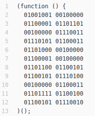
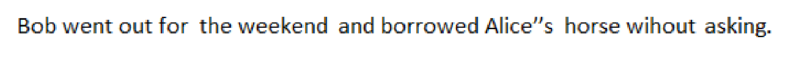
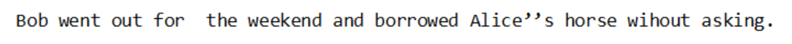
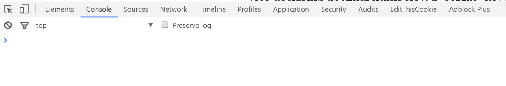
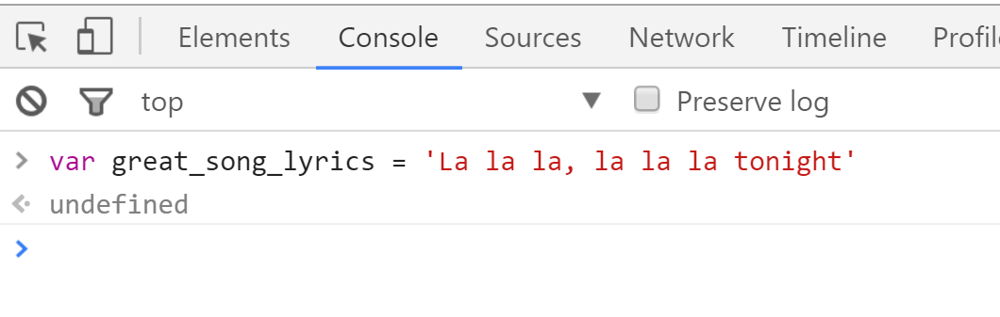
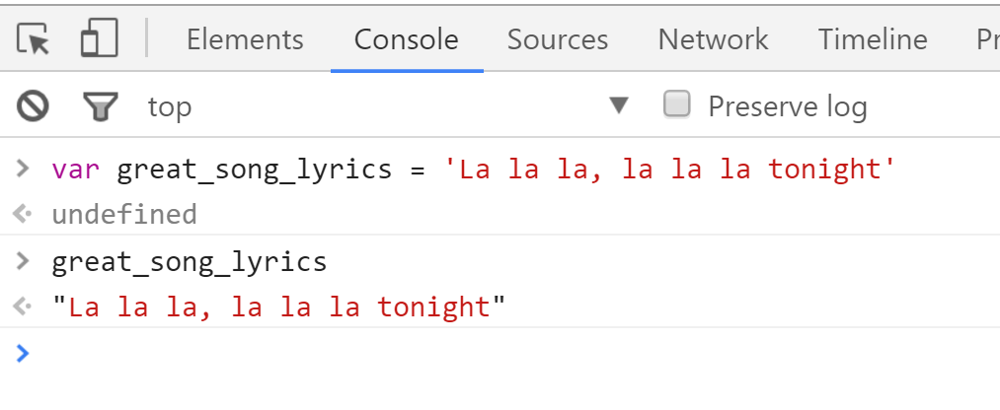
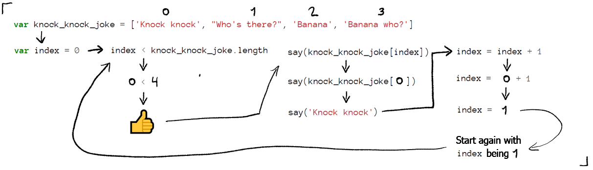

# How to code (in one chapter)

_Isaac Lyman_

_Note: This is the longest chapter by far. It also contains a fair amount of sarcasm. Many people appreciate the light humor in such a long read, but be sure to take it with a grain of salt._



This chapter is not a complete coding manual. It's a drive-through introduction to _just enough_ coding concepts and keywords to get you from zero to a basic script.

First of all: take a deep breath. The picture above isn't real code. At least, it isn't code that anyone uses. Real code---what I write on the job---is mostly composed of English words, symbols, numbers (all ten of 'em, not just ones and zeros), and made-up names. Once you learn a bit of vocabulary, it's readable. I'm going to cover each of these later on.

Let's get started.

### What is a computer program?

A computer program---also known as an _app_, an _application_, or a piece of _software_---is a collection of many lines of special text. They're special because a computer can understand them, and computers are incredibly dumb. The smallest practical apps have a hundred or so lines of text in them. The largest apps have [billions](http://cacm.acm.org/magazines/2016/7/204032-why-google-stores-billions-of-lines-of-code-in-a-single-repository/fulltext).

We call this special text _code_. Code is a set of step-by-step instructions, like a recipe. It tells computers what to do with _data_. Data is any piece of information that a computer can hold in its memory. Modern computers are pretty good at holding things like dates and sentences. If you have a Twitter account, then Twitter's got some flat, ugly computers at a warehouse that are holding your birthday and every tweet you've ever tweeted. Along with 300 million other people's birthdays and tweets.


_Source: [https://commons.wikimedia.org/wiki/File:CERN_Server_03.jpg](https://commons.wikimedia.org/wiki/File:CERN_Server_03.jpg). Unmodified image licensed under [CC BY-SA 3.0](https://creativecommons.org/licenses/by-sa/3.0/deed.en) by Florian Hirzinger_

That's all data. Don't worry, the computers aren't sitting around reading your old tweets for fun. And if they did, it wouldn't be "fun," anyway. It would be painful. Your tweets are dumb, just like mine.

When you visit twitter.com, your computer borrows a whole bunch of code from one of those ugly warehouse computers. It speed-reads the heck out of that code. And then it _executes_ that code, which means that the computer does exactly what the step-by-step instructions tell it to do.

If the instructions are written very carefully, it's all peaches from here on out. Twitter will work. It will publish your dumb tweets to the entire world. It will let you read other people's dumb tweets. It will let you "like" those tweets.

If there is any flaw in those instructions---anything from a typo to complete misinterpretation of the data---then Twitter will not work. It will show an "Error" message, or crash the app, or suffer in silence, secretly doing things with your data that you would prefer it not to.

That's the catch. Coding isn't very hard. It requires you to memorize a couple hundred terms and learn some grammar rules---you could do this with English (or your native language) by the time you were two, and human languages are a _mess_. What _is_ hard is being called out by an anal-retentive computer every time you press a wrong key or misunderstand a concept. The hard part about coding is the sheer amount of frustration you have to absorb.

The fun part is the problem-solving. In modern software, real-world problems become puzzles that can be solved by code---but only after you truly understand them. Once you wrap your mind around every possible permutation of a problem, you can write code that addresses it thoroughly, step by step.

### The tools of the trade

A programmer's toolbox typically consists of a few things:

- A computer.
- An internet connection. You need an internet connection so you can use Google. When you don't know how to do something (which happens about 787283493857 times per day) you Google it. When your app gives you an error message, you Google it. You Google everything.
- A code editor (or an IDE, which is a code editor on steroids). Think of it as Microsoft Word for coding. It helps you organize and proofread your code.
- A compiler or interpreter. This is a program that reads your code, tries to find mistakes so it can bug you about them, gathers your code into a nice little package, and then passes it on to the computer to execute. It does a lot of other things, too, but these are the things you need to know about right now.
- A good pair of headphones. These help you ignore people so you can focus.

You probably already have a computer. Since you downloaded this book, you definitely have an internet connection and an interpreter (Firefox and Chrome have interpreters built in). There are plenty of free code editors available online (like [VS Code](https://code.visualstudio.com/) or [Atom](https://atom.io/)). I can't help you with the headphones, but a good alternative is staring at people until they leave.

So you're all set, right?

### Programming languages

There are thousands of programming languages in the world. Many of them are [dumb](https://en.wikipedia.org/wiki/Esoteric_programming_language) and [useless](https://en.wikipedia.org/wiki/Code_golf#Dedicated_golfing_languages). You can have a long and happy career only knowing three or four---but don't worry, this isn't as hard as learning three or four human languages.

Programming languages are often described by their _paradigm_, which is a way of categorizing the kinds of features they have. For example, JavaScript is the language that all web browsers run, and possibly the most popular programming language in the world. It has a diverse feature set; I might say that JavaScript supports imperative, structured, object-oriented, and event-driven paradigms. And you might say I'm a pretentious geek.

You don't need to know what all those words mean. What you do need to know is that programming languages with similar paradigms usually have similar _syntax_---that is, vocabulary and grammar. So once you've learned one language (like JavaScript), you're already 75% of the way to learning similar languages, like Python and Ruby.

The best coders understand problems in terms of an _algorithm_---a series of steps that can be used to do a certain thing, even if the details are different each time. Have you ever bought something on Amazon? The checkout experience is a sort of algorithm. No matter what you're buying, the steps are roughly the same: fill up your cart, choose your credit card and shipping address, pick a shipping speed and place your order. The code, in fact, is the same for each purchase. The difference is all in the data. Now get this: every algorithm that can possibly exist can be written in every normal programming language. It's a [mathematical fact](https://en.wikipedia.org/wiki/Turing_completeness). Once you learn to think in algorithms, the programming language is secondary. Sure, it kicks and drags its feet a little. But in the end it's not about the keywords and symbols you're using. It's about the processes you're describing.

From here on out, I'm going to use the JavaScript programming language to give examples. I'm doing this for my benefit, not yours. I'm good at JavaScript.

Code examples will be printed in [monospace](https://en.wikipedia.org/wiki/Monospaced_font), which is a special typeface that `looks like this`. Monospaced fonts give the same exact width to every letter, number, symbol and space. All code is written in monospace even though it is harder to read than normal fonts. This is because it helps align blocks of code and allows coders to give equal attention to every letter and symbol, which helps them avoid errors. As an example, look at the following sentence in both a regular font and monospace:





There are three mistakes in the sentence: the extra space after "for", the extra apostrophe in "Alice's", and Bob's exploitation of Alice's friendship and trust. Oh, and "without" is misspelled. You probably saw all these mistakes in the first sentence, but they're more obvious in the second one, and _obvious_ is your best friend when you're scanning a 200-line code document.

Whenever you read something written in monospace, it's okay if you do a robot voice in your head.

### Putting data in code

Enough background: let's write some code. The most basic building block of a computer program is a _variable_. A variable is a name for a piece of data, like a number or a sentence. You have to name your data.

There are two reasons you name your data:

1.  You don't know what it is beforehand. Does Facebook know your birthday before you type it in? No, of course not. Facebook's code is using a name like `humans_birthday` behind the scenes (the underscore is there because variable names can't have spaces in them). It attaches that name to whatever birthday you type in. That way, the code can be exactly the same whether your birthday is June 10th, September 9th, or December 86th. It just moves `humans_birthday` around in the program until it reaches an ugly warehouse computer.
2.  You don't want to forget what it means. Suppose the computer program needs to know that December 86th isn't a real date. So somewhere you have to tell it that December has 31 days. 31 is a number, a piece of data. But if you're using the number 31 all over your code, and also using numbers like 30 and 28 (because, thank goodness, December isn't the only month), your code is going to be confusing to read. What are all those numbers for? So you name them. 31 becomes `the_number_of_days_in_december`, and your code becomes self-explanatory. Beautiful.

Computers expect you to _declare_ your variables. A variable declaration is like a birth certificate for a piece of data. It looks like this:

```javascript
var the_number_of_days_in_december
```

The operative word here is `var`. It's short for "variable." The abbreviation is nice because it's faster to type. It can also be typed with only one hand, so if all you're doing is declaring variables all day, your other hand is free to do awesome things like juice grapefruits and practice with a quarterstaff.

Another thing you do with variables is _assign_ them. This is where you attach the name to a piece of data. It looks like this:

```javascript
the_number_of_days_in_december = 31
```

Easy stuff. You declare the variable, then you assign it, and then any time you want to use the number 31 in your program, you can type `the_number_of_days_in_december` and the computer will know what you mean.

You don't have to assign every variable to an explicit piece of data when you write your program. You can declare variables and assign them to things that don't exist yet. For example, you can declare `var humans_birthday` and tell the app to wait for the user to type it in. Whatever they type will become `humans_birthday`. You don't even have to worry about it.

Variables can hold way more than just numbers and dates. For example, you can declare a _string_, or a piece of text:

```javascript
var great_song_lyrics = 'La la la, la la la tonight'
```

Whoa. Curveball. I just declared a variable and assigned it _at the same time_. I'm so hecking efficient. Bring this man a grapefruit.

Now I can write `great_song_lyrics` in my code, wherever I want, and the computer will know that I mean `'La la la, la la la tonight'`. It's like we're talking...in _code_.

Don't believe me? Try it right now. If you're reading this on your phone, you'll need to open a web browser, like Chrome or Firefox, on a computer. Press the F12 key on your keyboard (if you're using Safari, you'll have to find the developer tools in the menus). You'll see something like this:



_This may be aligned to the right or bottom edge of your browser._

Make sure the "Console" tab is selected. Click in the blank area next to the `>` symbol, type a variable declaration and assignment, and press Enter:



The console is saying `undefined` because the line of code you typed didn't produce any data. That's okay, it wasn't supposed to. Now type the name of your variable and press Enter again:



Hooray! The console (which is an _interpreter_) understands your variable. The variable `great_song_lyrics` _evaluated_ (it was understood) as `"La la la, la la la tonight"`. That's perfect (by the way, it doesn't matter if you use single quotes `'` or double quotes `"` as long as you use them in matching pairs).

We'll talk about other things variables can hold in just a second.

Many programming languages require you to be specific about what _kind_ of variable you're declaring. In C++, for example, there is no `var` keyword. There's an `int` keyword (for declaring small whole numbers), a `long` keyword (for declaring big whole numbers), `float` and `double` keywords (for declaring decimal numbers), a `string` keyword (for declaring pieces of text), and a few others. Don't worry about that right now. You can learn it later.

### Complex types

#### Objects

An important part of coding is learning how to organize data. Take the birthday example: Facebook has hundreds of millions of birthdays (and anniversaries and breakup dates) stored in computer memory in its warehouse. How does it know what's what? If I gave you a list of a billion dates, would you know who they belong to and what they're for? Of course you would, because you are the great Calendifus, Greek god of randomly significant dates.

Luckily, Facebook doesn't just have a pile of arbitrary dates sitting around. They connect your birthday, your anniversary, your hometown, your employment history, your name, and everything else they know about you together with a unique ID (like the one on your Social Security card or your driver's license). It's probably a big number that they picked out of a hat, so to speak. That is, you are number 12884002, and every piece of data they have on you has a label that says "12884002", and when you log in they look up everything with that number on it. It's all organized just like that.

In code, you would do this with an _object_. An object is a bunch of pieces of data all organized together. We can also call this an _associative array_, a _dictionary_, or a _map_. But most often I just say _object_.

In JavaScript, objects are declared and assigned much like other variables. Here's an example object:

```javascript
var human = {
  id: 12884002,
  age: 28,
  name: 'Bob',
  favorite_song: 'Half Light, by Athlete'
}
```

Each piece of data in an object is like a seesaw. The name is on the left, the data is on the right, and there's a `:` in the middle to balance on. Really all we've done is declare four variables: the first two are numbers, and the last two are strings. But they're organized together so we can find them whenever we need to know something about `human`. And instead of calling them "variables," we call them "properties" or "fields." An object can have any properties you want, as long as you put them all together inside of `{` curly brackets `}`.

We can move the `human` object around and refer to it just like any other variable. The computer knows what we mean. If we ever want to refer to just one property of `human`, we use a dot, like this:

```javascript
human.id
human.age
human.name
human.favorite_song
```

Each of these is just like any other variable. We can assign something to it and refer to it later. Want to change Bob's name? Easy:

`human.name = 'Alice'`

And that's that. It's a really good upgrade, isn't it? From now on, whenever you type `human.name`, it will refer to "Alice".

#### Arrays

Sometimes you don't want to think up a unique name for every property in an object, especially if they're all very similar. Or you don't know how many there are going to be. That's when it's time to use an _array_, which is a list of similar pieces of data. Arrays can grow or shrink as needed.

A good example is all your dumb tweets. Twitter doesn't know how many tweets you're going to write. You started at 0, and look where you are now. Twitter could use an array to hold them all. Arrays in JavaScript look like this:

```javascript
var dumb_tweets = [
  'Hello, Twitter!',
  'My friends are so cool',
  'Does anyone want a LaCroix?'
]
```

Remember how objects used `{` curly brackets `}` ? Arrays use `[` square brackets `]`. This array has three strings in it, separated by commas. And yes, it's a variable just like anything else. You can use `dumb_tweets` anywhere in your code, and it will refer to the array we defined just now.

If you want to refer to a specific string in the array, you'd do it like this:

```javascript
dumb_tweets[0]
dumb_tweets[1]
dumb_tweets[2]
```

We use the name of the array, `dumb_tweets`, and then inside of `[` square brackets `]` we use the number (or _index_) of the thing (or _element_) we want to refer to. I know it's weird that the first element in the array is number 0. But this is your life now. From this day forward, you will always begin counting at 0. It's the programmer way.

Each of the above expressions (an _expression_ is any code that turns into a piece of data when you run it) is a variable. You can assign something new to it, if you want.

```javascript
dumb_tweets[2] = 'I regret literally everything I have ever said'
```

Whatever happened to `'Does anyone want a LaCroix?'`? It's gone forever. Swallowed by the abyss. G'bye!

Arrays can hold strings, numbers, dates, objects, and even other arrays. You can put arrays inside of arrays inside of arrays inside of arrays.


_Photo: [Lachlan Fearnley](https://commons.wikimedia.org/wiki/File:Russian_Dolls.jpg). Unmodified image licensed under [CC BY-SA 3.0](https://creativecommons.org/licenses/by-sa/3.0/deed.en)_

Any time code or data gets all Russian-doll-ish like that, we say it's _nested_.

Arrays can also be properties of objects. An object can have a property that is an array of objects, each of which has a property that is an array of objects...and I've done it again. It sounds like a tax form, but it's how data is structured. For example, your Twitter account could be an object that has a property which is an array of tweets; each tweet could be an object that has properties that are arrays of replies, likes, and retweets; each reply, like or retweet could be an object that has properties that are the name, profile picture and bio of the user that gave them; and so on.

```javascript
var nested_object = {
  an_array: [
    {
      another_array: [
        {
          yet_another: [
            {
              message: 'Blink twice if you need help'
            }
          ]
        }
      ]
    }
  ]
}
```

To access `message`, you can write:

```javascript
nested_object.an_array[0].another_array[0].yet_another[0].message
```

And the computer will know that you mean `'Blink twice if you need help.'`

#### Objects (continued)

One more trippy part, and then we can move on to the fun stuff.

_Everything_ in JavaScript is secretly an object (don't tell! Its parents would be so mad). For example, our `dumb_tweets` array has a property that we never declared:

```javascript
dumb_tweets.length
```

What the heck is `length`? Well, it's a property that JavaScript creates and updates for you automatically. It tells you how many elements are in the array. In this case it would be 3. There are 3 elements in the array. Go count 'em, but don't start from 0 this time because I lied and you're only supposed to start counting from 0 on special occasions. Dang it.

### APIs

Time for a scary campfire story.

Once upon a time, in an alternate universe, there was a programmer named McChuck. He was the only coder in the whole universe. He had to write all the code that would ever exist, all by himself.


_Photo: [hannah k](https://www.flickr.com/photos/90692443@N05/8239219385). Unmodified image licensed under [CC BY 2.0](https://creativecommons.org/licenses/by/2.0/)_

Sheesh, it was just a story. Calm down.

The truth is that no coder is an island. Nobody starts from scratch. We're all constantly using code we didn't write---buckets of it, in fact.

Even if you are a prolific coder and write millions of lines of code in your lifetime, you will use far more lines of code that someone else wrote. Most of this code will come from complete strangers. Some of those strangers will be dead. Their code lives on, even though the fingers that typed it are decomposing in a grave. It's zombie code. But instead of eating your brain, it saves your brain from doing a lot of hard work. Best. zombie. ever.

How do you use this zombie code? Copy and paste? Occasionally, yes, but not often. Most of the time you'll access it through an Application Programming Interface or _API_. An API is a bundled-up set of properties and _methods_ (purpose-built pieces of code) that are named, like variables, so you can refer to them by their name and let them do their thing. They do all kinds of useful things for you.

JavaScript arrays have their own API. The `length` property is part of this API. Another part of it is the `push` method, which adds an element to the end of the array:

```javascript
dumb_tweets.push('Man I hate good attitudes')
```

A method is like a property because you access it with a dot. A method is different from a property because you have to put `(` parentheses `)` after it. These parentheses are holding the data we want to add to our array. Now `dumb_tweets` has four elements. It looks like this:

```json
[
  "Hello, Twitter!",
  "My friends are so cool",
  "I regret literally everything I have ever said",
  "Man I hate good attitudes"
]
```

Remember, the index of this last element is 3 (because you started counting at 0). So you would refer to it as `dumb_tweets[3]`. And `dumb_tweets.length` would now evaluate to 4.

The JavaScript array API has a lot of different methods in it, but it's outside the purpose of this chapter to explain them all. You can see them in their full glory [at this link](https://developer.mozilla.org/en-US/docs/Web/JavaScript/Reference/Global_Objects/Array).

Web browsers have a huge API that JavaScript coders use every day. This API has methods for things like animating stuff in a website, getting user input, communicating with other computers over the internet, manipulating strings, and loads of other stuff. Building a working vocabulary in this API is an essential part of becoming a web developer.

### Functions

_Function_ is another word for _method_. It's just a piece of code that does something and (usually) has a name. Functions are easy to declare in JavaScript:

```javascript
function giveMeOne() {
  return 1
}
```

We start with the keyword `function`. Then we give the function a name, just like if we were declaring a variable (here I've used capitalization, instead of underscores, to separate words). Then we use parentheses (you'll see why in a second). Then we use `{` curly brackets `}`. Inside the curly brackets are all the lines of code we want to execute whenever the function is _called_ (whenever an expression refers to it by name).

The word `return` is another special keyword. It makes a _value_ (a piece of data) pop out of the function. Then it ends the function (if you write any code after a `return` statement, that code won't execute). So you could do something like this:

```javascript
var the_loneliest_number = giveMeOne()
```

This isn't too hard, right? We declare a variable named `the_loneliest_number`. The assignment part of our statement calls `giveMeOne()`, and since that function says `return 1`, a 1 pops out. So our variable will hold the number 1. Go ahead and execute both of these blocks of code in your browser's console. Then type `the_loneliest_number`, press Enter, and you'll see that it evaluates to 1.

A function can be a property of an object. It can be an element of an array. It can return a number, a date, a string, an object, an array, another function, an array full of functions, and so forth. This stuff is like LEGO bricks. Put any kind of piece anywhere you want and it will fit.

`giveMeOne()` is kind of like `dumb_tweets.push()`. The main differences are:

1. `giveMeOne()` is a function we wrote by ourselves. `push()` is a function that some strangers wrote. It's okay, they don't mind if we use it.
2. `push()` is a method of `dumb_tweets` (and any other array we'll ever create). `giveMeOne()` is _global_, meaning that we don't need to refer to a specific object in order to use it.

You'll notice one more thing that seems different about them: `giveMeOne()` uses empty parentheses, but `push()` expects us to put a piece of data in the parentheses. In fact, `push()` would be useless if we couldn't tell it what to add to our array. The piece of data we give it is called an _argument_. An argument is just a piece of data that we drop into a function. Declaring a function that expects arguments looks like this:

```javascript
function addTheseNumbersTogetherPlz(number1, number2) {
  return number1 + number2
}
```

This function isn't too different from `giveMeOne()`. But instead of empty parentheses, these have variable names in them, separated by a comma. These are our arguments. The `return` statement does exactly what it looks like it's doing: it adds number1 and number2 together, then pops out the result. You'd call the function like this: `addTheseNumbersTogetherPlz(3, 4)`. And it would pop out a 7.

Ooh! Math! Scary, right? Almost all coding languages let you write math expressions the same way you used to write them in those bricky TI calculators you might have used in high school. You can use `+` to add, `-` to subtract, `/` to divide, `*` to multiply, `(` parentheses `)` to enforce an order of operations, `%` to get the remainder of division, and `^` to instantly grow a neckbeard (no, it doesn't do exponents; you need an API for that).

You could also write the function this way:

```javascript
function addTheseNumbersTogetherPlz(number1, number2) {
  var sum = number1 + number2

  return sum
}
```

This function does _exactly the same thing_. It just uses a variable named `sum` as a middleman, where the result is stored so we can return it later.

There are many ways to write a function. You should choose the way that most clearly expresses what the code is doing. Code that is concise and easy to understand is often called _expressive_ or _elegant_. There's an artistic pleasure in writing this kind of code.

> Programs must be written for people to read, and only incidentally for machines to execute. 
> 
> *~ Harold Abelson*

### Logical branches and comparisons

This is where code gets _extra_ fun. (It was fun already.)

Computer programs don't do the same exact thing every time you run them. If they did, then video games would play themselves. That would be a letdown. You'd have to just sit there and watch the story play out on the screen, like a...I don't know, but it would be boring. There definitely wouldn't be an [entire industry](https://en.wikipedia.org/wiki/Film_industry) dedicated to it.

Programs have to respond to different situations. They have to make decisions. And that's where things like `if` statements come in.

Let's say we're writing an app that determines whether a particular person is allowed to enter a nightclub. Pretend there's a method in the JavaScript API that gets a user's age. We'll call it `getUserAge()`. We'll also imagine that there are two other methods, `allowThemInTheNightclub()` and `throwThemOutOnTheirButt()`. How can we help our program decide which of these last two methods to call, based on the returned value of the first method?

```javascript
var age = getUserAge()

if (age >= 21) {
  allowThemInTheNightclub()
} else {
  throwThemOutOnTheirButt()
}
```

See how nice the alignment is on the right side? Monospace is great.

You already know what the first line does. `age` will hold a value like 13 or 21 or 101. Now we need to know: is `age` 21 or over? If so, they can party away. If not, they'll need to leave.

We do that using an `if` statement. `if` is a keyword that looks a little bit like a method. The argument it expects is an expression of some kind, usually a _comparison_. Comparisons take two values and compare them to each other, resulting in a value of `true` (if the comparison is true) or `false` (if it's not true). These two values are called _booleans_ and they're the only two booleans in existence. Lucky they've got each other. We can make six different kinds of comparisons:

- `===` (three equals signs) compares the values on either side to see if they are exactly equal. If they are equal, the result is `true`. `6 === 6` would be `true`.
- `!==` compares the values on either side to see if they are _not_ exactly equal. If they are _not_ equal, the result is `true`. `6 !== 3` would be `true`.
- `>` checks to see if the value on the left side is bigger than the value on the right side. `6 > 3` would be `true`.
- `<` checks to see if the value on the _right_ side is bigger than the value on the _left_ side. `3 < 6` would be `true`.
- `>=` checks to see if the value on the left side is bigger than, or equal to, the value on the right side. `6 >= 6` and `6 >= 5` are both `true`.
- `<=` checks to see if the value on the _right_ side is bigger than, or equal to, the value on the _left_ side. `6 <= 6` and `6 <= 7` are both `true`.

`if` statements evaluate the comparison you give them. If it evaluates to `true`, they execute the code inside their _block_ (the lines of code inside `{` curly brackets `}`). If it evaluates to `false`, they skip that code.

`if` statements can also have an `else` statement attached to their tail end. The `else` statement has a block that will be executed if the comparison is `false`. Look back at our nightclub app. It should make a lot of sense to you now.

Hey, we just made a bouncer _redundant_ (he was replaced by a computer program). Isn't that a good feeling?

### Loops

Sometimes, especially when you're working with an array, you want to execute a block of code several times in a row. This is _not_ the time to use copy and paste. Instead, you should use a loop. The simplest kind of loop in JavaScript is a `while` loop:

```javascript
var knock_knock_joke = ['Knock knock', "Who's there?", 'Banana', 'Banana who?']

var index = 0

while (index < knock_knock_joke.length) {
  say(knock_knock_joke[index])

  index = index + 1
}
```

`while` loops use the same syntax as `if` statements. You use parentheses, you pass in a comparison, you follow it up with a block. But an `if` block only executes the code inside of it once (or zero times, if the comparison evaluates to `false`). A `while` block executes the code inside of it _over and over again_ until the condition is `false`. That is, it evaluates the condition; if it's `true`, it executes the block; then it evaluates the condition again; if `true`, it executes the block _again_; then it evaluates the condition again; and so on, forever. I've invented an imaginary API here that has a `say()` method, but everything else is regular JavaScript.



How many times will the loop execute? Well, the first time it evaluates the comparison, it checks to see if `index` (which is 0) is smaller than `knock_knock_joke.length` (which is---go on, count them---4). Since the comparison is `true`, it executes the code, which raps `knock_knock_joke[0]`, because `index` is still 0. Then the magic happens: it changes `index` to `index + 1`, or 0 + 1, which is 1. Then it evaluates the comparison expression again. 1 is still less than 4, so it executes the block again---but this time, since index is 1, it raps `knock_knock_joke[1]`. Get it? It will stop executing the block when `index` equals 4, which is good because `knock_knock_joke[4]` _doesn't exist_. When a loop operates on multiple elements in an array, we say it's _iterating_.

### Null and undefined

If you declare a variable and do not assign a value to it, it will hold a special value called `undefined`. This is a geeky word that means "move along, nothing to see here." It's mostly useless.

JavaScript also has a special value called `null`. It means roughly the same thing as `undefined`. They really shouldn't have included both words in the language. But they did and it's too late now.

### Scopes

Functions are very selfish. If you declare a variable inside of a function, the function won't let any of the code outside of itself use the variable. For example:

```javascript
function whatHappensInVegas() {
  var wildIndiscretions = ['partied', 'danced']

  return 'I admit nothing'
}

whatHappensInVegas()
whatHappensInVegas()
whatHappensInVegas()

if (wildIndiscretions.length > 0) {
  getInTrouble()
}
```

We have a very simple function. It declares the variable `wildIndiscretions`, but it doesn't return it. The outside world knows nothing about it! We even run the function three times, because we're young and full of stamina. The `if` statement is trying to pry into the function's personal life, but it can't. The code inside of the `if` block will never execute. In fact, the comparison `wildIndiscretions.length > 0` will _throw an error_ (it won't work and you'll see a message explaining why) because `wildIndiscretions` is `undefined` outside of the function `whatHappensInVegas`. It doesn't have _any_ properties, let alone `length`.

However, if you move that `if` block inside the `function` block (before the `return` statement, of course) then it will gain access to `wildIndiscretions`. Hope you have a good lawyer!

### Comments

It isn't always obvious what a piece of code is doing, or what still needs to be done with it. If you need to break out of the computer language and have some real talk about what's going on in the code (or just drop some dope lyrics), you can use a _comment_, or a line of code that the computer will ignore. You start a comment with `//` two forward slashes. Like this:

```javascript
function isEven(num) {
  // This function determines if "num" is even or odd.
  //  If even, it returns true. If odd, it returns false.
  // TO DO: add a second argument that lets you specify
  //  a message to display if "num" is odd.

  return num % 2 === 0

  // Hey, yo, do it like Isaac
  // If you ain't with me, baby ain't wise-aac
}
```

Don't worry about the maths in the `return` statement. I'm just demonstrating that you can use comments to explain what's going on, to leave a note for your future self, _and_ to spit bars. The last usage is probably frowned upon in serious codebases. But don't let that hold you back. You were born to do what you were born to do.

### Searching for clues

The last and most important thing I can teach you is this: when you don't know how to do something, immediately go to google.com and ask. The generosity of the programming community will astound you. Thousands of developers all around the world have freely shared their code and knowledge on sites like [GitHub](https://github.com/) and [Stack Overflow](http://stackoverflow.com/), which means that all you need to become an expert in any programming language is a steady internet connection and the ability to read.

Good Google queries take a little bit of practice to write. A good template is something like this:

`[programming language] how to [something]`

For example, want to know how to remove an element from an array in JavaScript? I'm not gonna teach you. Try typing this into Google: "JavaScript how to remove an element from an array". The first few results should give you all the information you need (with examples).

For more discussion of this topic, see Yechiel's chapter "Learning to learn".

### What is an application?

Most large-scale apps use all the concepts and keywords I've described. Their code comprises thousands upon thousands of lines of code, all built from these same basic elements. So what are they _doing_?

On a basic level, they're receiving _inputs_ (data that enters the code from somewhere else, like a user's keyboard), transforming them (often by iterating over them, doing maths on them, or reorganizing their properties), and providing _outputs_ (data that leaves the code). Every computer program can be described in terms of its inputs and outputs. Every programming language has methods in its API for accepting inputs and providing outputs.

An ice maker is a good analogy for a computer program. Its inputs are water and electricity (they come from an API known as "municipal utilities"). Its output is ice (which is submitted to an API known as "a tall glass of Coke"). Do you care what happens in the middle? Not right now, as long as you get your ice without too much trouble. But someday the ice maker will break down. And whoever has to fix it will care _a lot_ about how simple, robust and well-built its internal components are.

A coder's job isn't just to provide the ice, although that's important. A coder's job is to make sure that when the ice maker breaks, the person who has to fix it doesn't develop an explosive headache in the process. That's the difference between an amateur coder and a pro.

### Conclusion

You've done good. I've taught you enough programming basics that, with a little imagination and plenty of Googling, you can teach yourself everything you need to know to write apps. If you want to.

You may still feel like you're missing some vital information. And you are. But you'll never learn it all, and this is a good start.

If you're still shaky on your feet, go check out some more JavaScript tutorials. There are tons of free ones online on sites like [Codecademy](https://www.codecademy.com/learn/introduction-to-javascript). And once you feel confident enough to write some code of your own, _go build something_. There's no substitute for getting your hands dirty.
