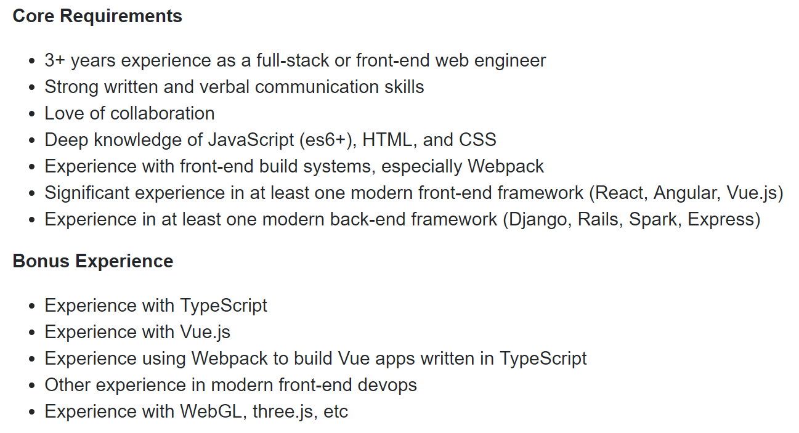

{:: encoding="UTF-8" /}

# What to learn first

_Isaac Lyman_

I occasionally get a message from a brand-new developer who's overwhelmed by all the technologies and choices that exist in the world of software development. Where do you even start? Some of these devs have seen job advertisements like the following:

This is for a standard, mid-level web development position. It lists 14 specific technologies, alludes to many more, and if that weren't enough, it has an "etc." Even as a senior software engineer, I'm not sure what that "etc." refers to. Maybe I could Google it:

Oh, great. 16 more technologies. If I were brand-new to this, I'd be thinking, "you mean I have to learn 30 different programming languages just to get a mid-level job?" And then I'd throw up my hands and apply for a job in something less demanding, like brain surgery.

Let's put that fear to bed: no, you don't have to learn 30 different programming languages, now or ever. You need to learn one. Then you need to learn a few tools that are commonly used with that language. That will get you a junior position. Afterward, you've got options: get better and better with the languages and tools you already know (you might call this the "expert in the room" route), or learn several more (the "startup engineer" route). Either route will let you advance your career and make more money, and neither is necessarily better than the other, but you'll probably find that you strongly prefer one of them.

So where should you start?

Make a list of technologies you're considering. Then pick one, any way you like. If there's a company you want to work for and they recruit heavily for one of them, pick that one. Or if you know _what_ you want to build, pick the tech that goes with it (see Appendix B for ideas). Or go with your gut. Or flip a coin, or roll a d20, or pick one out of a hat. There's no "best" technology. What's important here is that you _commit_. Spend time getting to know the technology, building simple projects with it, reading articles about it, finding GitHub repositories that use it.

Some people start second-guessing themselves after a day or two with a new technology, so they switch to a different one, and then another one, and then another. This is like learning to say "Good morning" in 50 different languages. It's a party trick, not a marketable skill. Don't let yourself do this. Even if you spend five years with something and decide it's not for you, it's not a total loss; 75% or more of the skills you've learned will transfer neatly to your next technology. The consequences of choosing the "wrong" technology are tiny.

If you don't know a programming language yet, I recommend starting with JavaScript, Python or C#. All of these are extremely popular and in high demand. If you already know JavaScript, learn a utility tool like Lodash and a web framework like React or Vue, or learn Node.js and a server-side framework like Express or Hapi. If you know Python, learn a data science library like NumPy or Pandas, or a web framework like Django or Flask. If you know C#, learn ASP.NET MVC to build web applications, Xamarin to build native apps, or Unity to build video games.

Once you've picked some technologies, the best thing you can do is _start a project_ (see Leonóra's chapter "Making the most out of side projects"). Think up something small and simple you want to build, then put it together a step at a time, learning what you need to learn as you go along. This is the best way to gain competence. It doesn't much matter what you build, as long as it's interesting to you---to-do list apps are the cliche, but you could just as easily build a game, a unit conversion calculator, a chat room, a conversation bot, or anything else that comes to mind. The only limit is your imagination. For some free ideas, check out the [graveyard tag](https://dev.to/t/graveyard) on dev.to, where several developers have written about the projects they've built on their own over the years.

Once you finish your project you'll have a nice portfolio piece, along with the confidence of knowing you can see a project through from start to finish. And you'll be well on your way to being an expert in the technology of your choice.

I promise, as long as you don't go out of your way to choose strange and obscure technologies, anything you choose can lead to a successful career. There are plenty of jobs out there waiting for you.
